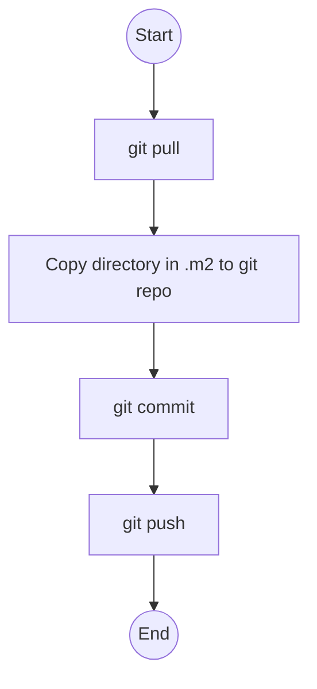

# MavenRepoPublisher

## 简介
本程序主要用于把本地maven仓库中的jar包发布到远程的git仓库中。

## Build
./gradlew shadowJar

在libs目录下会生成build的输出，这个输出会把整个依赖库打包在一起，这样就可以直接运行。

## 使用方法

```shell
java -jar MavenRepoPublisher-1.0-SNAPSHOT-all.jar [local maven repository directory] [maven repo]
```
参数说明：
* [local maven repository directory] ：本地仓库目录 
* [maven repo] ： 本地git maven 目录

例如：
```shell
java -jar MavenRepoPublisher-1.0-SNAPSHOT-all.jar org/grails/grails-datastore-gorm-mongodb ../maven
```

## 实现逻辑

